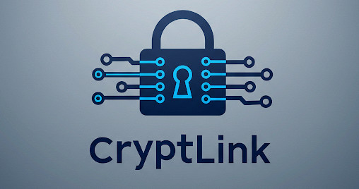

# CryptLink - Secure Peer-to-Peer File Transfer

<!-- Optional: Add a logo here -->

  

**CryptLink** is a desktop application designed for secure peer-to-peer (P2P) file transfers. It utilizes TLS encryption and certificate-based authentication to ensure that your files are exchanged privately and securely directly between two trusted parties, without relying on intermediary cloud services.
**Important Note:** CryptLink is primarily designed for use between peers on the same Local Area Network (LAN) or connected via a Virtual Private Network (VPN) that allows them to reach each other directly by IP address or hostname. It does not include NAT traversal or relay servers for connecting peers across separate, disconnected internet networks without a VPN.
**Notice:**  CryptLink was created with the assistance of Generative AI.
## ✨ Features

*   **Secure P2P Transfers**: Files are sent directly between users over an encrypted TLS channel.
*   **Certificate-Based Authentication**: Ensures you are connecting to the intended peer using mutual TLS authentication.
*   **Peer Fingerprint Verification**: An essential out-of-band step to confirm peer identity and prevent man-in-the-middle attacks.
*   **Encrypted Identity Bundles (.clb)**: Easily share and import identities (CA certificate, client certificate, and client key) using password-protected bundles.
*   **Keyring Integration**:
    *   **User Identity**: Securely store and load your personal CryptLink identity (certificates and key) using your system's native keyring.
    *   **Admin CA**: Administrators can securely store the Certificate Authority (CA) certificate and private key in the system keyring.
*   **Admin Tools**: Built-in tools for administrators to:
    *   Create and manage a local Certificate Authority (CA).
    *   Generate client identity bundles signed by the CA for distribution.
*   **Remembered Past Connections**: Quickly reconnect to previously connected peers via a dropdown list.
*   **Configurable Settings**:
    *   Adjust logging verbosity (DEBUG, INFO, WARN, ERROR).
    *   Enable/disable manual certificate configuration for advanced users.
    *   Clear past connection history.
*   **Cross-Platform**: Built with Python and Tkinter, designed to run on various operating systems.
*   **User-Friendly Interface**: A graphical user interface for ease of use.

## 🛡️ Security

CryptLink prioritizes security through several mechanisms:

1.  **TLS Encryption**: All data transmitted between peers, including file contents and commands, is encrypted using Transport Layer Security (TLS 1.2 or higher).
2.  **Mutual Certificate Authentication**: Both the client and server authenticate each other using X.509 certificates. This ensures that both parties are who they claim to be, based on a shared Certificate Authority (CA) or pre-shared certificates.
3.  **Certificate Fingerprint Verification**: Before a connection is fully established, users are prompted to verify the SHA-256 fingerprint of the peer's certificate. This verification **must be done out-of-band** (e.g., over a phone call, secure message) to prevent Man-in-the-Middle (MitM) attacks.
4.  **Encrypted Identity Bundles**: The `.clb` files, used for distributing client identities, are encrypted using AES (via Fernet) with a key derived from a user-provided password using PBKDF2HMAC-SHA256. This protects the private key and certificates within the bundle.
5.  **Secure Keyring Storage**:
    *   The Certificate Authority's private key (for admins) is stored in the system's native keyring, leveraging OS-level security.
    *   User identities (certificates and private key) can also be saved to the keyring, encrypted with a Fernet key that is itself stored in the keyring.

## 🎯 Use Cases

*   Securely transferring sensitive documents, project files, or personal data between two individuals.
*   Avoiding reliance on third-party cloud storage services for privacy-critical file exchanges when direct P2P is feasible.
*   Situations where a direct, encrypted peer-to-peer connection (LAN/VPN) is preferred for control and security.
*   Small teams or individuals on a shared network (or VPN) needing a straightforward method for secure ad-hoc file sharing.
*   Users operating in environments with direct network access between peers (LAN/VPN), even if the broader network path might be untrusted.

## 🚀 Getting Started & Basic Usage

### Prerequisites

*   Python 3.x
*   Pip (Python package installer)

### Installation

1.  Clone or download the CryptLink repository.
2.  Navigate to the CryptLink directory in your terminal.
3.  Run `python main.py` (or `python3 main.py`). The application includes a dependency checker (`dependencies.py`) that will attempt to guide you through installing any missing Python packages (`cryptography`, `keyring`) if they are not found.

### Step-by-Step Guide

#### 1. Setting up Your Identity (First Time / New Identity)

To use CryptLink, you need a cryptographic identity (a CA certificate, your client certificate, and your private key).

**A. Using an Admin-Provided Bundle (Recommended for most users):**

If an administrator (or another CryptLink user acting as a CA) has provided you with a `.clb` identity bundle and its password:

1.  Launch CryptLink.
2.  Navigate to the **Identities** view from the top menu.
3.  In the "Certificates & Bundles" section, click **Import Bundle**.
4.  Select the `.clb` file you received.
5.  Enter the password for the bundle when prompted.
6.  If successful, your identity will be loaded. The status on the Home view should change from "No Certs" to "Certs Loaded".

**B. Saving Your Identity to Keyring (Optional, for convenience):**

After successfully loading an identity (either via a bundle or manually), you can save it to your system's secure keyring for automatic loading on future startups:

1.  In the **Identities** view, under "Identity Persistence (Keyring)".
2.  Click **Save to Keyring**.
3.  Your identity is now securely stored. On subsequent launches, CryptLink will attempt to load it automatically.

#### 2. Connecting to a Peer

1.  Ensure your identity is loaded (status on Home view should be "Certs Loaded").
2.  Navigate to the **Home** view.
3.  In the "Connection" section, enter the **Peer IP/Host** of the user you want to connect to.
    *   If you have connected to this peer before, their details might appear in the dropdown list.
4.  Click **Connect**.
5.  **CRITICAL STEP: Verify Peer Fingerprint**
    *   A dialog will appear showing your certificate fingerprint and the fingerprint of the peer you are connecting to.
    *   **You MUST verify the peer's fingerprint with them out-of-band** (e.g., read it over a phone call, compare via a trusted messaging app).
    *   If the fingerprints match, click "Yes" to trust the peer and establish the connection.
    *   If they do not match, or if you cannot verify, click "No" or "Cancel". **Do not proceed if fingerprints don't match!**
6.  Once both users accept each other's fingerprints, the status will change to "Securely Connected".

#### 3. Sending a File

1.  Ensure you are "Securely Connected" to a peer.
2.  In the "File Transfer" section on the Home view, click **Choose File**.
3.  Select the file you wish to send.
4.  Click **Send File**.
5.  The peer will be prompted to accept or reject the file.
6.  Monitor the progress bar and status messages for transfer updates.

#### 4. Receiving a File

1.  Ensure you are "Securely Connected".
2.  When a peer initiates a file transfer to you, a dialog will pop up asking if you want to accept the file. It will show the filename and size.
3.  Verify these details. If you trust the sender and the file, click **Yes**.
4.  The file will be downloaded. Progress is shown in the "File Transfer" section.
5.  Successfully received files are listed in the "Received Files" panel on the right. Double-click an entry to open the file (it's typically saved to your system's Downloads folder).

#### 5. Disconnecting

*   On the Home view, in the "Connection" section, click **Disconnect**.

## 🛠️ Admin Section: Managing Certificates and Bundles

This section is for users who need to act as a Certificate Authority (CA) to issue identities to other CryptLink users.

### A. Creating a Certificate Authority (CA)

The CA is the root of trust for your CryptLink connections. Its private key must be kept secure.

1.  Launch CryptLink.
2.  Navigate to the **Admin Tools** view from the top menu.
3.  In the "Certificate Authority (CA)" section, the status will indicate if a CA is already loaded from the keyring.
4.  If no CA is found, click **Load/Create CA**.
5.  A dialog will ask if you want to create a new CA. Click "Yes".
6.  You will be prompted to enter details for your CA certificate (Common Name, Organization, Country, etc.). Fill these in appropriately.
    *   Example Common Name: `MyCompany CryptLink CA`
7.  Click "OK".
8.  The CA certificate and its private key will be generated and stored securely in your system's native keyring. The status in the Admin Tools view will update.

### B. Generating a Client Bundle (.clb)

Once you have a CA, you can generate client identity bundles for users.

1.  In the **Admin Tools** view, ensure your CA is loaded (the status should indicate "CA Status: Loaded from Keyring").
2.  Go to the "Generate Client Bundle (.clb)" section.
3.  Enter a unique **Client Name (CN)** for the user/client this bundle is for (e.g., `JohnDoe`, `Alice-Laptop`). This name will appear in their certificate.
4.  Click **Generate Bundle**.
5.  You will be prompted to set and then confirm a **strong password** for the bundle. This password protects the contents of the `.clb` file.
6.  Choose a location to save the `.clb` file.

### C. Distributing Client Bundles

1.  Securely transfer the generated `.clb` file to the intended client.
2.  Securely communicate the password for the bundle to the client through a separate, trusted channel.
3.  The client will then use the "Import Bundle" feature in their CryptLink application (as described in "Getting Started") to load their identity.

### D. Exporting/Clearing CA (Advanced)

*   **Export CA...**: This allows you to save the CA certificate and its private key (unencrypted) to PEM files. **Use this feature with extreme caution**, as the CA private key is highly sensitive. It's primarily for backup purposes or migration, and the exported files must be stored very securely.
*   **Clear CA**: This permanently removes the CA certificate and private key from your system keyring. This action is irreversible without a backup.

## ⚙️ Other Features & Settings

### Settings View

Accessible from the top menu, the Settings view allows you to:

*   **Logging Verbosity**: Choose the level of detail for application logs (DEBUG, INFO, WARN, ERROR). DEBUG is most verbose.
*   **Enable Manual Identity Configuration**:
    *   **Disabled (Default & Recommended for most users)**: Users are urged to import `.clb` bundles. Most manual certificate/key selection buttons on the "Identities" page are hidden, except "Import Bundle".
    *   **Enabled (Advanced)**: All certificate and key selection buttons on the "Identities" page become visible, allowing users to load individual CA certificate, client certificate, and client private key files manually. This is for users who manage their certificates outside of the bundle system.
*   **Clear Past Connections**: Removes all remembered peer connection history from the dropdown on the Home view and from the `settings.json` file.

### Identities View

Accessible from the top menu, the Identities view allows you to:

*   **Import Bundle**: Load a `.clb` identity bundle.
*   **Manual Certificate Loading** (if "Enable Manual Identity Configuration" is checked in Settings):
    *   Select individual files for "CA Cert", "Client Cert", and "Client Key".
    *   Click "Load Certs" to validate and use them.
*   **Export Bundle**: If you have a valid identity loaded (either manually or from a previous bundle), you can export it as a new password-protected `.clb` file. This is useful for backing up your identity or sharing it if you are acting as a point of distribution.
*   **Identity Persistence (Keyring)**:
    *   **Save to Keyring**: Saves the currently loaded valid identity to your system's secure keyring for automatic loading on startup.
    *   **Clear from Keyring**: Removes your saved CryptLink user identity from the keyring.

## ⚠️ Troubleshooting & Notes

*   **Firewalls**: Ensure your system firewall (and any network firewalls) allows inbound connections on the port CryptLink uses (default: `7900`) if you want to receive connections. For outbound connections, ensure CryptLink is allowed to make network requests.
*   **VPNs & IP Addresses**:
    *   CryptLink works well over VPNs that establish a direct IP-level connection between peers, effectively placing them on the same virtual network.
    *   CryptLink attempts to determine your local IP address. In complex network setups (like VPNs or multiple network interfaces), the IP address reported in the `PEER_INFO` exchange might be your local LAN IP, not necessarily the IP your peer sees you connecting from (e.g., your VPN IP).
    *   The "Remembered Past Connections" feature prioritizes the IP address from which a connection was *actually received* (for servers) or the IP address *successfully connected to* (for clients) to improve reliability in such scenarios.
*   **Certificate Errors**: If you encounter SSL or certificate errors, ensure:
    *   Both peers are using certificates signed by the same CA (or the CA certificate itself if it's self-signed and distributed).
    *   The system time on both computers is reasonably accurate, as certificate validity is time-sensitive.
    *   The certificate files are not corrupted.
*   **Network Connectivity**: CryptLink requires direct network reachability between peers. It does not perform NAT traversal. If peers are on different, isolated networks without a VPN connecting them, they will not be able to connect directly.

## 🤝 Contributing

Contributions, bug reports, and feature requests are welcome! Please feel free to open an issue or submit a pull request on the GitHub repository.

---

*This README was generated based on CryptLink version 0.4.0.*
